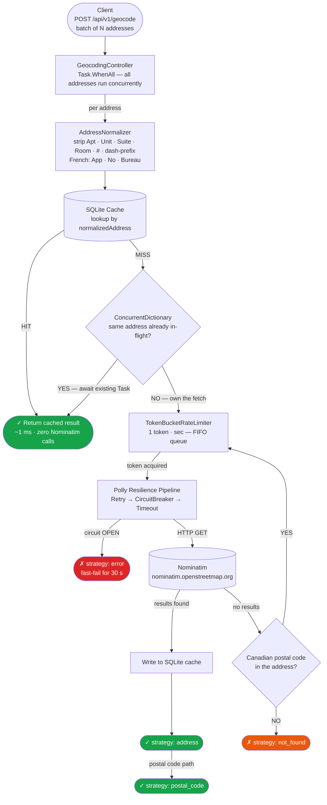
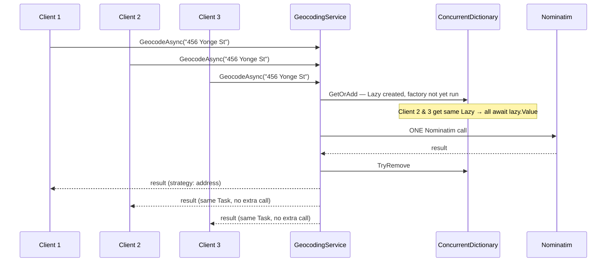

# Positrace Geocoding API

ASP.NET Core 9 Web API that forward-geocodes Canadian street addresses via the [Nominatim](https://nominatim.org/) public API. Built for the Positrace Senior Backend Engineer technical assessment.

---

## Quick start

### Option A — Docker (no SDK needed)

```bash
git clone https://github.com/aahme249/positrace-Forward-GeocodingWeb-API-Task.git
cd positrace-Forward-GeocodingWeb-API-Task
docker compose up --build
```

### Option B — .NET 9 SDK

```bash
git clone https://github.com/aahme249/positrace-Forward-GeocodingWeb-API-Task.git
cd positrace-Forward-GeocodingWeb-API-Task/GeocodingApi
dotnet run
```

| | Docker | .NET SDK |
|---|---|---|
| API | http://localhost:8080/api/v1/geocode | http://localhost:5050/api/v1/geocode |
| Swagger UI | http://localhost:8080/swagger | http://localhost:5050/swagger |

The SQLite cache (`geocoding.db`) is created automatically on first run. No database setup needed.

---

## Try it immediately

**Open Swagger UI** at the URL above — the request and response fields are pre-filled with a mixed example covering all four strategies. Click **Try it out → Execute**.

Or paste this into a terminal:

```bash
curl -X POST http://localhost:8080/api/v1/geocode \
  -H "Content-Type: application/json" \
  -d '{
    "addresses": [
      "Apt. 4 456 Yonge St, Toronto, ON M4Y 1X9",
      "123-12 Main St, Toronto, ON M5V 2T6",
      "Unit 201 789 Queen St W, Toronto, ON M6J 1G1",
      "Bureau 7 1000 Rue De La Gauchetière O, Montreal, QC H3B 4W5",
      "99999 Nowhere Blvd, Apt 12, Toronto, ON M5V 3A8"
    ]
  }'
```

---

## POST /api/v1/geocode

**Request**

```json
{
  "addresses": [
    "123-12 Main St, Toronto, ON M5V 2T6",
    "Apt. 4 456 Yonge St, Toronto, ON M4Y 1X9"
  ]
}
```

**Response**

```json
{
  "results": [
    {
      "originalAddress": "123-12 Main St, Toronto, ON M5V 2T6",
      "normalizedAddress": "123 Main St, Toronto, ON M5V 2T6",
      "latitude": 43.6532,
      "longitude": -79.3832,
      "displayName": "123, Main Street, ...",
      "strategy": "address",
      "found": true,
      "error": null,
      "retryCount": null
    }
  ]
}
```

Results are returned in the same order and count as the input list, and each one echoes `originalAddress` so every result maps unambiguously back to its source — including duplicate address strings within the same batch.

### `strategy` values

| Value | Meaning | `error` | `retryCount` |
|---|---|---|---|
| `address` | Nominatim matched the normalised street address | null | null |
| `postal_code` | Address query returned nothing; result comes from the postal code | null | null |
| `not_found` | Neither query returned results | null | null |
| `error` | Nominatim was unreachable or returned an HTTP error | exception message | retries fired before giving up |

**Example error response:**

```json
{
  "originalAddress": "123 Main St, Toronto, ON",
  "normalizedAddress": "123 Main St, Toronto, ON",
  "latitude": null,
  "longitude": null,
  "displayName": null,
  "strategy": "error",
  "found": false,
  "error": "No such host is known. (invalid.example:80)",
  "retryCount": 3
}
```

---

## Architecture

### Request flow



### Concurrent deduplication



---

## Design decisions

| Problem | Alternatives considered | Chosen | Why |
|---|---|---|---|
| **Cache key** | Raw address | **Normalized address** | `"Apt 4 123 Main St"` and `"Unit 4 123 Main St"` resolve to the same geocode — one cache entry serves both |
| **Database** | SQLite · Redis · Postgres | **SQLite** | Zero-dependency, single-file, sufficient for cache table; `docker compose up` stays a one-liner |
| **Rate limiting** | `Task.Delay` · `SemaphoreSlim + timestamp` · `TokenBucketRateLimiter` | **`TokenBucketRateLimiter`** | Built-in since .NET 7, no manual clock arithmetic, no edge-of-window burst, FIFO queue |
| **Rate limit vs retry** | One Polly pipeline for both | **Separate layers** | Rate limiting controls throughput; retry reacts to failure — mixing them makes each harder to reason about |
| **Concurrency model** | Locks · `Channel<T>` · `ConcurrentDictionary + TCS` · `IMemoryCache` | **`ConcurrentDictionary<string, Lazy<Task<T>>>`** | Single-flight guarantee via `GetOrAdd` + `Lazy`; no manual TCS lifecycle, no `while(true)` retry loop |
| **Fallback** | None · postal code | **Postal code** | Address may be typo'd or absent in OSM; the postal code in the same string usually still resolves to a valid location |
| **Service lifetime** | Scoped · Transient | **Singleton** | `NominatimClient` owns the rate-limiter state; `GeocodingService` owns the in-flight dedup map — both must live for the app's lifetime |

### Why `TokenBucketRateLimiter` over the alternatives

`Task.Delay(1000)` is broken under any concurrency — two simultaneous callers both pass the delay check and fire together. `SemaphoreSlim(1,1)` with a manual timestamp gate works but requires discipline: releasing before the HTTP call (not through it) is non-obvious and easy to miss. `TokenBucketRateLimiter` handles this correctly by design — replenishment is timer-driven, so holding a lease through the HTTP call does not delay the next token. Calls fire at ≤1/sec and overlap in-flight correctly.

`FixedWindowRateLimiter` was also rejected: a call at `t=0.99s` and one at `t=1.00s` both pass the 1-req/1s window (two calls 10ms apart), which Nominatim would treat as a burst. `TokenBucket` enforces genuine spacing regardless of window edges.

### Why not `Channel<T>` for deduplication

A `Channel<WorkItem>` with a single background consumer would fully decouple callers from Nominatim — the right architecture for high inbound volume (callers arriving faster than 1/sec and not wanting to hold connections open). At this scope — single instance, public Nominatim at 1/sec, workload dominated by cache hits — the added complexity (background service, work-item structs, silent-crash failure mode) isn't justified. The `ConcurrentDictionary + TaskCompletionSource` pattern achieves the same deduplication guarantee within the request lifecycle without a separate worker.

If inbound volume regularly exceeds Nominatim's processing rate, the right step is switching to an async job API (`POST` → `202 Accepted` + job ID, client polls), which is the natural next step described in the Scalability section.

### Concurrency model evolution: TCS → `Lazy<Task<T>>`

The initial implementation used `ConcurrentDictionary<string, Task<CachedGeocode?>>` with a manual `while(true)` + `TryAdd` + `TaskCompletionSource` loop:

```csharp
// Original pattern
while (true)
{
    if (_inFlight.TryGetValue(key, out var existing))
        return await existing.WaitAsync(ct);       // join existing fetch

    var tcs = new TaskCompletionSource<CachedGeocode?>(TaskCreationOptions.RunContinuationsAsynchronously);
    if (!_inFlight.TryAdd(key, tcs.Task)) continue; // lost the race — retry

    try   { var r = await Fetch(); tcs.SetResult(r); return r; }
    catch (Exception ex) { tcs.SetException(ex); throw; }
    finally { _inFlight.TryRemove(key, out _); }
}
```

This is correct — `TryAdd` atomically elects one winner and the `TCS` propagates both result and exception to all concurrent waiters. But it carries manual lifecycle management: the `while(true)` retry, `TCS` setup, explicit `SetResult`/`SetException`, and `TryRemove` in `finally`.

The current implementation replaces it with `Lazy<Task<T>>`:

```csharp
// Current pattern
var lazy = _inFlight.GetOrAdd(key,
    _ => new Lazy<Task<CachedGeocode?>>(() => FetchEvictAndCache(key),
         LazyThreadSafetyMode.ExecutionAndPublication));

return await lazy.Value.WaitAsync(ct);
```

**Why this is better:**

- `GetOrAdd` may construct competing `Lazy` instances under contention, but only one is stored in the dictionary — the rest are discarded and their factories never run
- `LazyThreadSafetyMode.ExecutionAndPublication` guarantees the stored `Lazy`'s factory executes exactly once, even if multiple threads simultaneously access `.Value`
- `.WaitAsync(ct)` preserves per-caller cancellability without cancelling the shared fetch (same as `existing.WaitAsync(ct)` in the original)
- `TryRemove` moves to a dedicated `FetchEvictAndCache` helper, removing it from the hot concurrency path
- The `while(true)` loop, manual `TCS`, and `SetResult`/`SetException` calls are gone entirely

The correctness guarantee is identical. The code surface area is smaller and the intent is immediately readable.

### Why not `IMemoryCache.GetOrCreateAsync` for deduplication

`IMemoryCache.GetOrCreateAsync` does not provide single-flight semantics — if two requests arrive simultaneously and both miss the cache, both execute the factory and both call Nominatim. The `ConcurrentDictionary` pattern here is more correct because `TryAdd` is atomic: only one caller wins the race and the rest await the winner's `Task`. A library like `LazyCache` (which wraps `Lazy<Task<T>>` inside `IMemoryCache`) would provide the same guarantee with a cleaner API, and is the natural next step if the dedup logic grows more complex.

---

## Address normalization

[`AddressNormalizer`](GeocodingApi/Services/AddressNormalizer.cs) strips unit qualifiers before the address reaches Nominatim. The original and normalized strings are both returned in every response so it's always visible what was actually queried.

**Rules applied in order:**

1. Dash-prefixed unit at the very start of the string (`123-12 Main St` → `123 Main St`) — done first so later passes don't shift the leading digits
2. English qualifiers: `Apt`/`Apt.`, `Unit`, `Suite`/`Ste`/`Ste.`, `Room`, `Building`/`Bldg`, `Floor`/`Fl`, `#`
3. French qualifiers: `App`/`App.` (Appartement), `No`/`No.` (Numéro), `Bureau`
4. Collapse orphaned whitespace and commas left by removals

Unit identifiers with a spaced letter suffix are handled (`Unit 12 A` → same as `Unit 12A`).

French directional suffix `O` is expanded to `Ouest` before the query is sent — OSM stores the full word, not the abbreviation (`Rue Sherbrooke O` → `Rue Sherbrooke Ouest`). `E`/`N`/`S` are not expanded because they are ambiguous with English East/North/South used in Ontario and BC addresses.

**Known limitations:**

- The dash-prefix rule only fires at the very start of the trimmed address — civic number always comes first in Canadian addressing, so this is correct for all real inputs.
- French street type prefixes (`Rue`, `Avenue`, `Boulevard`) are not interchangeable in OSM. If the input says `Rue McGill College` but OSM indexes it as `Avenue McGill College`, the address search returns nothing. The postal code fallback recovers the location if the postal code is indexed — if neither is, the result is `not_found`. This is an input data quality issue, not a normalisation bug; the fix is to use the correct street type in the source address.
- Some Quebec postal codes are absent from Nominatim's OSM dataset. When both the address search and the postal code fallback return empty, `not_found` is returned rather than an error.

---

## Transient failure handling

Three layers protect against Nominatim being slow or unavailable:

**Retry** — on a transient failure (5xx, timeout, `HttpRequestException`), retries up to `Nominatim:RetryCount` (default 3) times with a fixed `Nominatim:RetryDelaySeconds` (default 2 s) between attempts.

**Timeout** — each individual attempt times out after `Nominatim:TimeoutSeconds` (default 5 s).

**Circuit breaker** — if `Nominatim:CircuitBreakerFailures` (default 5) consecutive calls fail within 30 s, the circuit opens and all calls fail immediately for `Nominatim:CircuitBreakerBreakSeconds` (default 30 s). Every state transition is logged:

```
error: Nominatim circuit breaker OPENED — 5 consecutive failures. Failing fast for 30s.
warn:  Nominatim circuit breaker HALF-OPEN — sending probe request
info:  Nominatim circuit breaker CLOSED — Nominatim is reachable again
```

**Per-address error isolation** — exceptions are caught per address, not per batch. One failed address returns `strategy: "error"` without affecting the rest of the batch.

---

## Logging & configuration

Structured logs are emitted at every stage with thread IDs so individual addresses can be traced across a concurrent batch:

| Event | Level |
|---|---|
| Incoming request | `Info` |
| Normalization applied | `Info` |
| Cache hit | `Debug` |
| In-flight dedup join | `Debug` |
| Postal code fallback | `Info` |
| Result found + coordinates | `Info` |
| Nominatim call fired | `Debug` |
| Retry | `Warning` |
| Circuit opened / closed | `Error` / `Info` |

To see logs when running via Docker: `docker compose logs -f`.

**Metrics**

Every outbound Nominatim call emits two instruments via `System.Diagnostics.Metrics` (built-in, OpenTelemetry-compatible, no extra packages):

| Metric | Type | Tags |
|---|---|---|
| `nominatim.calls` | Counter | `path: address \| postal_code`, `outcome: success \| error` |
| `nominatim.call.duration` (ms) | Histogram | `path: address \| postal_code`, `outcome: success \| error` |

**Grafana dashboard** — pre-provisioned at `http://localhost:3000` (login `admin` / `admin`) under **Dashboards → Nominatim Metrics**:

| Panel | What it shows |
|---|---|
| Call Rate | Calls/sec split by `address` vs `postal_code` and `success` vs `error` |
| Call Duration | p50 / p95 / p99 latency in ms |
| Total Calls | Cumulative count since startup |
| Error Rate | Percentage — turns yellow at 5%, red at 10% |
| Calls by Path | Pie chart — address search vs postal code fallback |
| Avg Duration | Rolling 5-minute average in ms |

**Prometheus** — raw queries at `http://localhost:9090`:

```
rate(nominatim_calls_total[1m])                          # calls per second
nominatim_calls_total{outcome="error"}                   # error count
rate(nominatim_calls_total{outcome="error"}[1m])         # error rate
histogram_quantile(0.95, rate(nominatim_call_duration_milliseconds_bucket[5m]))  # p95 latency
```

**Triggering errors to test the error panels** — point the service at an invalid Nominatim URL without rebuilding:

```bash
docker compose down -v
Nominatim__BaseUrl=http://invalid.example/ docker compose up
```

The `-v` flag wipes the cache volume so no cached results short-circuit the error path. Send any address — the response will show `"strategy": "error"`, `"retryCount": 3`, and the error message from the HTTP client. The Grafana error rate panel will spike after a few requests. After 5 consecutive failures the circuit breaker opens and `"error"` will read `"The circuit is now open and is not allowing calls."` with `"retryCount": 0` (no retries — fast-fail path).

Restart normally with `docker compose down && docker compose up` to restore.

View live in the terminal while the service is running:

```bash
dotnet-counters monitor --name GeocodingApi --counters GeocodingApi.Nominatim
```

Logs answer "what happened to this address" — metrics answer "how many calls were made, and how fast". The tags let you separate address-search latency from postal-code-fallback latency, and spot error rate spikes without grep-ing through logs.

All operational tunables are externalised — no rebuild needed:

| Key | Default | Purpose |
|---|---|---|
| `Nominatim:BaseUrl` | `https://nominatim.openstreetmap.org/` | Switch to a self-hosted instance |
| `Nominatim:UserAgent` | `Positrace-Geocoding-Service/1.0 (...)` | Required by Nominatim's usage policy |
| `Nominatim:RateLimitPerSecond` | `1` | Increase when using self-hosted Nominatim |
| `Nominatim:TimeoutSeconds` | `5` | Per-attempt timeout |
| `Nominatim:RetryCount` | `3` | Max retries on transient failure |
| `Nominatim:RetryDelaySeconds` | `2` | Delay between retries |
| `Nominatim:CircuitBreakerFailures` | `5` | Failures before circuit opens |
| `Nominatim:CircuitBreakerBreakSeconds` | `30` | How long circuit stays open |
| `ConnectionStrings:DefaultConnection` | `Data Source=geocoding.db` | SQLite path |

Keys can be overridden via environment variables (`Nominatim__TimeoutSeconds=10`) — see `docker-compose.yml`.

---

## Tests

31 automated tests across two suites:

```
dotnet test GeocodingApi.Tests/
```

| Suite | Coverage |
|---|---|
| `AddressNormalizerTests` | Every normalization rule: dash-unit, Apt, Unit (including spaced-letter suffix), Suite/Ste, Room, Hash, French App./No./Bureau; postal code extraction |
| `GeocodingServiceTests` | Address strategy, postal code fallback, not-found, cache hit on second call, normalization-to-cache-key collapse, concurrent deduplication (5 concurrent tasks → 1 Nominatim call), per-address error isolation |

Integration tests use real SQLite (in-memory) and a mocked `INominatimClient` — no live HTTP calls.

---

## Observed behaviour

Five tests run against a live Docker instance:

| Test | Scenario | Wall time | Nominatim calls | Outcome |
|---|---|---|---|---|
| 1 | 14-address mixed batch, cold cache | **2.2 s** | 12 unique | All 4 strategies returned correctly |
| 2 | Same 14 addresses (warm cache) | **18 ms** | 0 | 760× faster, zero Nominatim calls |
| 3 | 5 landmarks, cold cache | **4.4 s** | 4 (1 not_found) | Parliament Hill not in OSM — `not_found` |
| 4 | 5 remote places (Iqaluit, Inuvik, Churchill) | **17 ms** | 0 | Already cached from mixed batch |
| 5 | 4× same address, different qualifiers | **3 ms** | 0 | All served from one cache entry |

**Test 1 vs 2** — 14 cold addresses complete in 2.2 s (rate-limited at 1/sec). The same 14 warm return in 18 ms — **760× faster**. For a vehicle fleet revisiting known routes, the vast majority of requests are cache hits within the first run.

**Test 5** — `100 Queen St W`, `Apt 3 100 Queen St W`, and `Unit 7 100 Queen St W` all normalize to the same string and share one cache entry. No Nominatim call is made.

---

## Scalability

### Current ceiling (single instance, public Nominatim)

| Scenario | Throughput |
|---|---|
| Warm cache | ~1,000 addresses/sec (SQLite reads) |
| Cold cache | 1 address/sec (Nominatim's hard ceiling) |
| Typical fleet (high cache-hit rate) | ~1,000 cached + 1 cold/sec |
| Per day (cold) | ~86,400 unique new addresses |

For a fleet of hundreds of vehicles revisiting known routes this is comfortable — after the first run, most batches are pure cache hits.

### Path to higher throughput

**Async job API** — for batches that exceed ~50 cold addresses, replace the synchronous response with fire-and-forget:

```
POST /api/v1/geocode         → 202 Accepted  { "jobId": "abc-123" }
GET  /api/v1/geocode/{jobId} → 200 OK with results (or 202 still processing)
```

The `POST` returns in < 1 ms regardless of batch size. A background worker pool drains the queue at the configured rate and writes results to the cache. This eliminates open connections, enables backpressure, and survives restarts if backed by Redis / Azure Service Bus.

**Multiple instances** — the only blocker for horizontal scaling is the in-process `TokenBucketRateLimiter`: two pods would send 2 req/sec to Nominatim. Moving the rate-limit gate to Redis (distributed rate limiter + shared cache) removes this constraint. With a self-hosted Nominatim instance (Canada OSM extract, ~50 GB, no rate limit), a 100-worker pool reaches ~100 geocodes/sec, and N pods scale cached-request throughput linearly.

At significant scale, the geocoding pipeline becomes invisible — once the fleet's address space is cached, every subsequent request is a Redis read under 1 ms with no Nominatim involvement.

### Current limitations

| Limitation | Impact | Mitigation |
|---|---|---|
| Public Nominatim 1 req/sec | Max 3,600 new addresses/hour | Self-hosted Nominatim |
| In-process rate limiter | Cannot run more than one pod safely | Redis distributed rate limiter |
| SQLite single-writer | Not safe across multiple pods | Postgres or Redis shared cache |
| No batch size cap | Large cold batches hold connections open | Enforce max 50; async jobs above that |
| No per-client fairness | Large batch monopolises queue | Per-tenant rate limit slots |

---

## Development tooling

Built and iterated on using **Claude Code** in a terminal against this repo. I set the requirements and made the architectural calls (singleton lifetimes, cache key, fallback design, rate-limiter choice), used the agent to scaffold boilerplate and wire up the Docker/EF Core setup, then reviewed and adjusted the generated code before it went in.

[`CLAUDE.md`](CLAUDE.md) is a machine-readable onboarding file for coding agents — build/run commands, request-flow architecture, and the invariants behind each assessment requirement.
